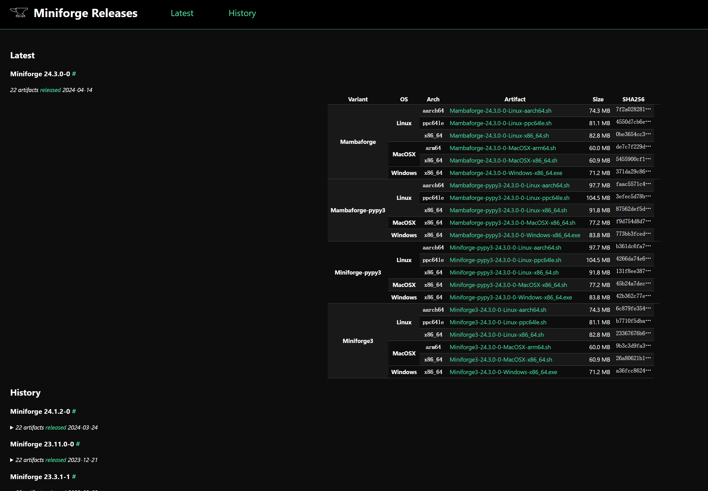
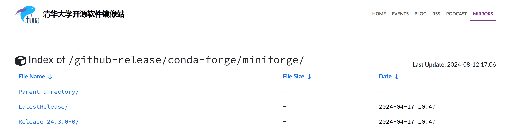
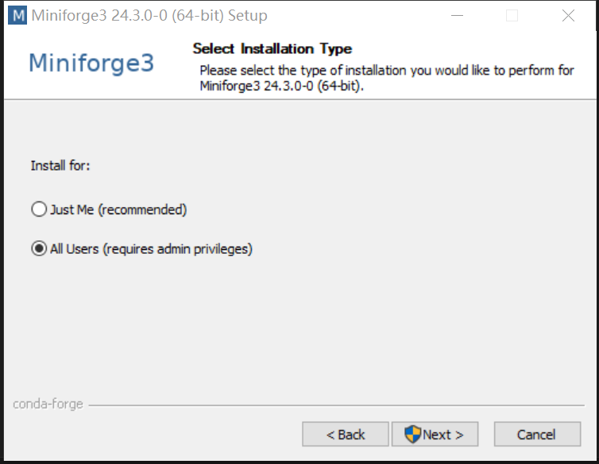
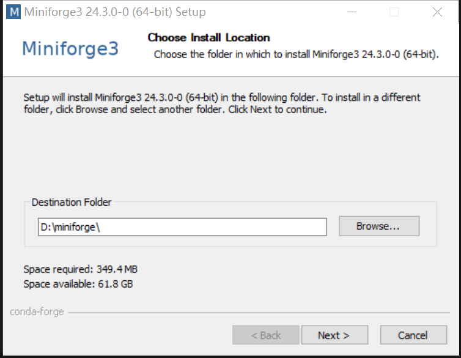
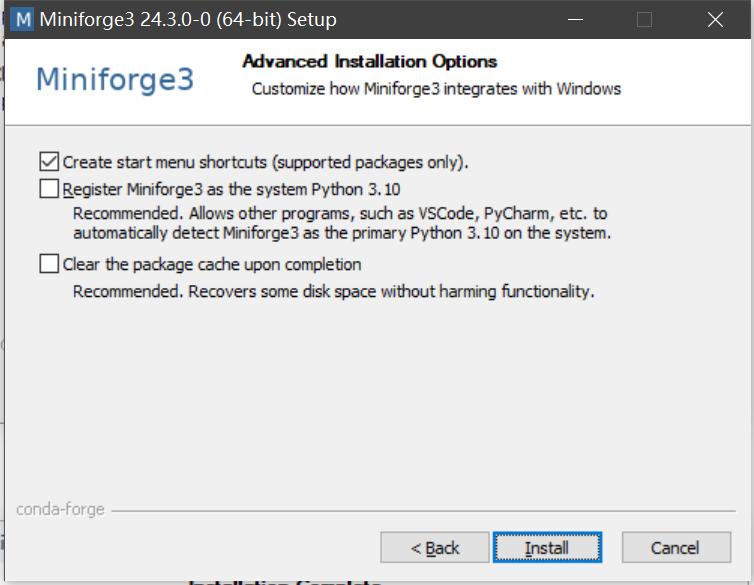
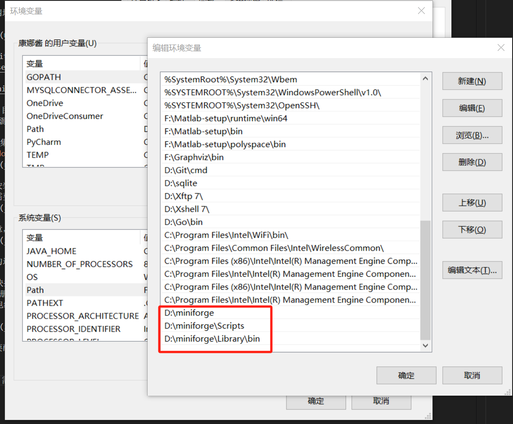
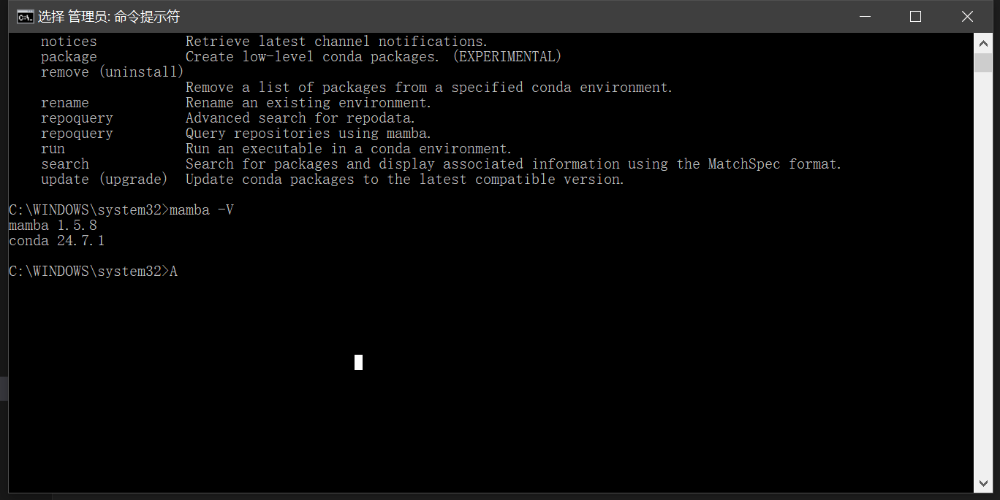

---

## miniforge3安装下载
miniforge是一个完全开源免费的pyhton包管理软件，可以在商业环境下暂时替代anaconda的python环境管理功能。可以兼容常用的conda命令。

miniforge的官方网址：<https://conda-forge.org/miniforge/>



其中资源是托管在github上的，国内的用户如果下载卡顿可以去清华大学镜像站进行下载：<https://mirrors.tuna.tsinghua.edu.cn/github-release/conda-forge/miniforge/>



`LatestRelease/`目录是最新的版本资源，`Release 24.3.0-0/`目录也是最新24.3.0-0的版本资源。这里面有名字叫miniforge和mamambaforge的资源。这相当与两个分支，具体的区别很小，但是官方建议安装miniforge。

需要根据cpu的指令集和操作系统来选择对应的版本进行下载。目前所需的x64指令集、windows操作系统，因此选择`Miniforge3-Windows-x86_64.exe`下载。


下载完毕点击进行安装。一直点继续。这里可以选择all useer，just me只是对当前windows用户安装，all useer是以管理员安装，所有用户都可用，需要管理员权限。


选择安装目录，注意，这里的安装目录**不能有中文**，否则会有奇奇怪怪的问题。


三个选项，可以都勾选上

* 在开始菜单创建快捷方式
* 将miniforge3注册为系统的python环境。允许其他程序VSCode、PyCharm等可以自动检测miniforge3作为主要的python环境
* 完成清除后清除包缓存



安装完成之后还需要配置环境变量。anaconda无需环境变量，但是miniforge需要手动配置环境变量。

## 配置环境变量
对于windows系统，需要配置在 `PATH`里面配置`D:\miniforge`、`D:\miniforge\Scripts`、`C:\miniforge\Library\bin`三个目录的环境变量。`\Scripts`目录下 有`pip.exe`、`conda.exe`、`mamba.exe` 等文件，如果配置错误可能会到这些命令用不了。



环境变量配置完成之后，新打开shell，输入`mamba -V`查看版本。miniforge最小化包含了conda和mamba。两者常用命令通用。



## miniforge常用命令
conda常用的命令，miniforge都兼容，同时也可以使用mamba命令去替换conda命令，在解析包依赖时mamba命令有时效率更高。在shell中初次执行conda命令可能需要输入`conda init`命令进行初始化，然后重新打开shell
### 查看帮助
这个很有用，可以查看命令，如果要查看具体命令的用法可以在命令后加-h
```shell
conda -h
```
### 查看当前环境
```shell
conda env list
```
### 激活环境
```shell
conda activate --name
```
### 新建环境
```
conda create  -n --name
```
###  新建环境指定python版本
```shell
conda create  -n test  python=3.7
```
### 指定镜像源
conda create -n test python=3.9 -c https://mirrors.sustech.edu.cn/anaconda/pkgs/main/ -y
### 移除环境
```shell
conda remove  -n --name
```
### 移除包
```shell
conda remove --name
```
### 查看当前conda配置
```shell
conda info
```

## miniforge替换清华源
由于默认的conda镜像源有时速度会很慢，因此可以替换成国内的源，这里替换成了清华源，也有中科大源、南方科大源等可以选择。
进入清华大学conda使用帮助：
<https://mirrors.tuna.tsinghua.edu.cn/help/anaconda/>
### 命令添加
进入shell，检查目前的镜像源
```shell
conda config --show channels
```
正常情况下只会有`defaults`。
使用`conda config --add default_channels`命令添加默认镜像源
```shell 
conda config --add default_channels https://mirrors.tuna.tsinghua.edu.cn/anaconda/pkgs/main
conda config --add default_channels https://mirrors.tuna.tsinghua.edu.cn/anaconda/pkgs/r
conda config --add default_channels https://mirrors.tuna.tsinghua.edu.cn/anaconda/pkgs/msys2
```
清除索引缓存
```shell
 conda clean -i
```

### 文件添加
各系统都可以通过修改用户目录下的 `.condarc` 文件来使用镜像源。
Windows用户无法直接创建名为`.condarc`的文件，可先执行`conda config --set show_channel_urls yes` 生成该文件之后再修改，文件生成的路径一般在`C:\Users\Usersname`下。
记事本打开文件进行编辑，用以下内容覆盖
```
channels:
  - defaults
show_channel_urls: true
default_channels:
  - https://mirrors.tuna.tsinghua.edu.cn/anaconda/pkgs/main
  - https://mirrors.tuna.tsinghua.edu.cn/anaconda/pkgs/r
  - https://mirrors.tuna.tsinghua.edu.cn/anaconda/pkgs/msys2
custom_channels:
  conda-forge: https://mirrors.tuna.tsinghua.edu.cn/anaconda/cloud
  msys2: https://mirrors.tuna.tsinghua.edu.cn/anaconda/cloud
  bioconda: https://mirrors.tuna.tsinghua.edu.cn/anaconda/cloud
  menpo: https://mirrors.tuna.tsinghua.edu.cn/anaconda/cloud
  pytorch: https://mirrors.tuna.tsinghua.edu.cn/anaconda/cloud
  pytorch-lts: https://mirrors.tuna.tsinghua.edu.cn/anaconda/cloud
  simpleitk: https://mirrors.tuna.tsinghua.edu.cn/anaconda/cloud
  deepmodeling: https://mirrors.tuna.tsinghua.edu.cn/anaconda/cloud/
```
`channels`、`default_channels`、`custom_channels`一共有三个设置项。
如果运行 `conda install some_package`命令，conda会按照先搜索`default_channels`，然后搜索`channels`。
如果要使用`custom_channels`，必须在命令后加上`-c`选项，指定custom_channels的名称`conda install some_package -c conda-forge`。